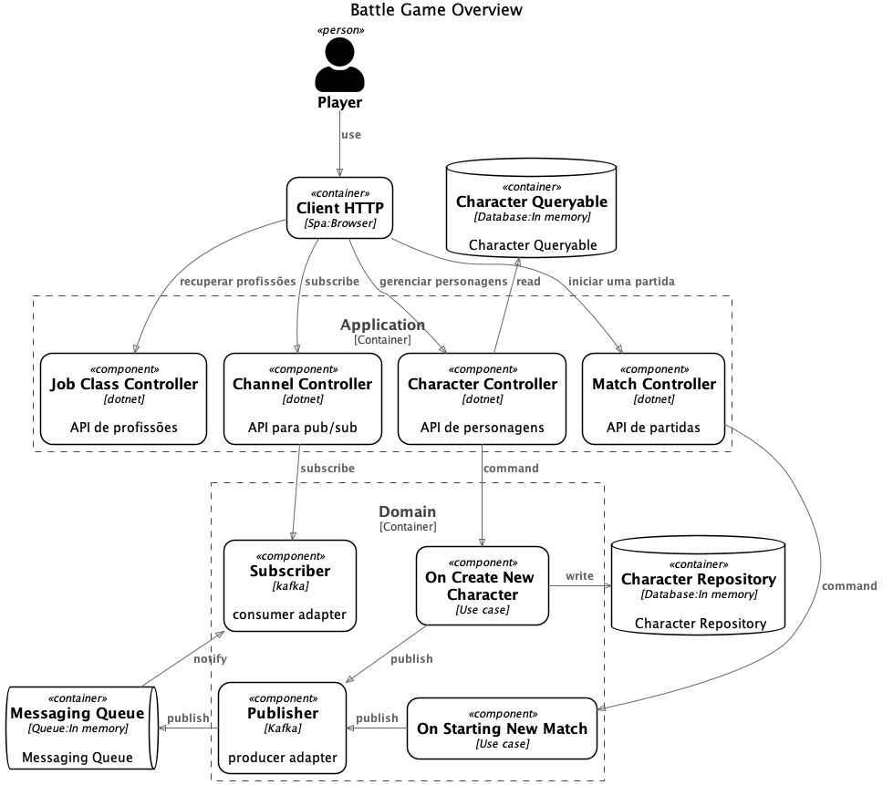

# PROJETO BATTLE GAME

## REQUISITOS
### Dependências
Para esse projeto será necessário instalar o [SDK](https://dotnet.microsoft.com/en-us/download/dotnet/6.0) do dotnet em sua versão 6.0 para compilar
e executar o projeto C#. Para visualizar o código de forma mais eficiente, sugerimos o uso do editor de código
[Visual Studio Code](https://code.visualstudio.com/download).

### Executando a aplicação
Para executar a aplicação você precisará acessar a pasta do projeto `Api` e iniciar a aplicação utilizando o comando `dotnet run`. Veja o código a seguir: 
```shell
$ cd src/Application/Api
$ dotnet run
```
Quando esse comando for executado o processo da aplicação dotnet será instanciado em listening no host `http://localhost:5161`. Uma alternativa a esse uso é a adoção do Docker, através do arquivo [Dockerfile](src/Application/Api/Dockerfile). 

### Executando testes automatizados
Para executar os test você precisará acessar a pasta do projeto `UnitTests` ou `IntegratedTests` e iniciar os testes utilizando o comando `dotnet test`. Veja o código a seguir:
```shell
$ cd tests/UnitTests
$ dotnet test
```

O resultado deve ser o seguinte
```shell
Starting test execution, please wait...
A total of 1 test files matched the specified pattern.

Passed!  - Failed:     0, Passed:    27, Skipped:     0, Total:    27, Duration: 71 ms 
```

## Consumindo API

#### **CANAL SUBSCRIÇÃO (PUB/SUB)**  
Para consumir os serviços da jornada do personagem é preciso um Id de subscrição. Esse Id é utilizado para recuperar os eventos associados as requisições do cliente HTTP.
- **`POST` /channel/subscribe**: serviço para subscrever-se no canal de notificação
- **`GET` /channel/{subscription}/events**: serviço para recuperar eventos

#### **JORNADAS DE PERSONAGEM**  
Para criação de novos personagens, você deve primeiro 
 - **`POST` /character**: serviço para criar novos personagens
 - **`POST` /match**: serviço para criar uma nova partida entre personagens 

#### **CONSULTAS**
 - **`GET` /jobclass**: serviço para recuperar todos as profissões
 - **`GET` /character**: serviço para recuperar todos os personagens
 
### Swagger
Para visualizar a documentação das APIs e a ferramenta de testes do Swagger você deve acessar a url `http://localhost:5161/swagger/index.html`. O resultado deve ser o seguinte:


### REST Client
Uma alternativa ao swagger é o uso do plugin [RestClient](https://marketplace.visualstudio.com/items?itemName=humao.rest-client) no Visual Studio Code. No repositório os arquivos de teste estão no diretório `tests/SystemTests/restclient`


### Postman
Caso deseje fazer um teste ponta-a-ponta da solução, você poderá utilizar o Postman e as coleções fornecidas na solução. Para isso, você precisará instalar o 
[Postman](https://www.postman.com/downloads/) e importar os arquivos no diretório `tests/SystemTests/postman`. Com os arquivos de coleção e environment importados, basta executar a coleção
`BattleGame API - Character`, como ilustra a imagem!


## Arquitetura

### Modelagem
A solução foi modelada baseando-se na abordagem [Clean Architecture](https://blog.cleancoder.com/uncle-bob/2012/08/13/the-clean-architecture.html), de Robert C. Martin. A imagem a seguir ilustra uma visão de alto nível dessa organização estrutural. 


De forma complementar e na perspectiva de componentes, a imagem (baseada em [C4 Model](https://c4model.com/)) a seguir ilustra os principais componentes da aplicação.


### Decisões Tomadas

#### EDA - Event-Driven Architecture
Pensando na dimâmica de um jogo e nas necessidades de _Availability_ e _Concurrency_, a solução foi desenvolvida baseada em arquitetura de eventos. 
Nesse sentido, as requisições de projeção na API, são feitas de forma assíncrona e processadas em threads secundárias da aplicação principal.
Para isso, foi adotado o padrão PUB/SUB, no qual o cliente deve subscrever no canal para receba as notificações do backend.
Sendo assim, para consumir os serviços da jornada do personagem é preciso um Id de subscrição. Esse Id é utilizado para recuperar os eventos associados as requisições do cliente HTTP.
- **`POST` /channel/subscribe**: serviço para subscrever-se no canal de notificação
- **`GET` /channel/{subscription}/events**: serviço para recuperar eventos.

#### Outras decisões
Abordagens e padrões adotados estão documentados nas classes do projeto. 
Como exemplo, veja a classe [Subscriber.cs](src/Infrastructure/MessageBroker/EventDriven/Subscriber.cs). 

#### PONTOS DE MELHORIA
* Todas as implementações de infrastrutura estão desenvolvidas em um modelo _InMemory_. Contudo como todas as classes estão abstraídas por intefaces da linguagem C#, é possível portar 
para implementações que utilizem plataformas ou serviços reais.
* A consulta de eventos do canal está implementada como serviço e para consumir na forma que está projetada, é preciso realizar _pooling_. Contudo, uma simples implemntação no controlador pode ajustar o app para fornecer uma API que suporte [SSE](https://developer.mozilla.org/en-US/docs/Web/API/Server-sent_events/Using_server-sent_events)
